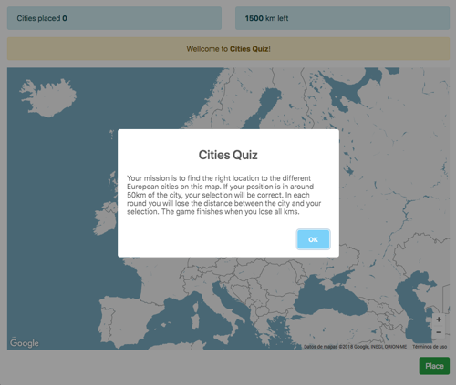
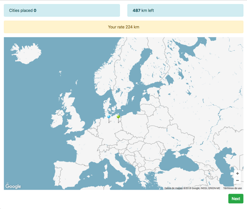

# A simple Cities Quiz

The game consist in to find different European cities on a mute map.

The player will see a map of Europe without Streets + Cities (Only Country-borders). Its mission is to find the right location to the city name on this map. After placing the needle pin, the game will show you the right location of the city and the difference of your needle pin and the city in kilometres. If it is in around 50km of the city, the selection will be defined as "correct".




## Instalation

To install this app run `npm i` from root directory.

## Configuration

Yo can change initial game configuration editing `config.js` file:

```js
module.exports = {
  INITIAL_KM_LEFT: 1500,
  SUCCESSFUL_DISTANCE: 50
};
```

Yo need config a valid Google API KEY. You must config it changing value `YOUR_API_KEY` in the `index.html` app script.

```html
<script src="https://maps.googleapis.com/maps/api/js?key=YOUR_API_KEY&region=EU&libraries=geometry"></script>
```

## Start scripts

| Command                      | Mode                                                     |
| ---------------------------- | -------------------------------------------------------- |
| `npm run webpack`            | Execute webpack in dev mode                              |
| `npm run webpacl-dev`        | Execute webpack in changes observe dev mode              |
| `npm run webpack-dev-server` | Execute webpack with automatic browser reload dev server |
| `npm run webpack-build`      | Execute webpack in production mode                       |

## Webpack config support

* Ejs templates
* SASS
* Babel trasnpiler
* Assets loaders with image optimizations

## This game use

* [Webpack](https://github.com/webpack/webpack)
* [Bootstrap](https://getbootstrap.com/)
* [sweetalert](https://sweetalert.js.org/)
* [pubsub-js](https://www.npmjs.com/package/pubsub-js)

### Bugs

20180516 | Solved a problem loading maps when used in a terminal with English language.
